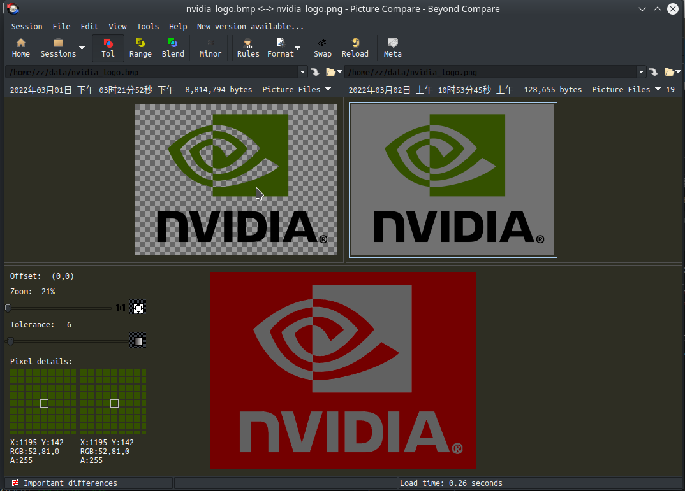
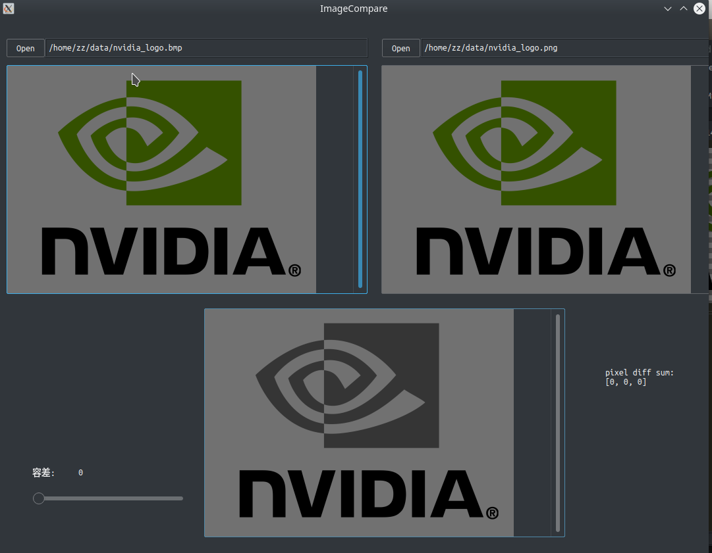

# Small Compare

Beyond Compare 的个人重制版。

## Features
- 图片比较
  - 显示差异图
  - 鼠标调节差异图阈值

## 缘由
实现和优化图像处理函数时比较结果图差异， 发现 Beyond Compare 加载的图像多次出现结果不对情况，例如要显示[assets/nvidia_logo.bmp](assets/nvidia_logo.bmp):


而 Beyond Compare 显示为棋盘格状的错误结果，进而导致和 [assets/nvidia_logo.png](assets/nvidia_logo.png) 的差异：


而实际上两张图的像素并无差异（Small Compare比较结果， 基于 OpenCV 4.5 的图像编解码）:


## Build
假定你熟悉基于 CMake 的 C/C++ 构建（不依赖 qmake）

- 安装 Qt 环境（Qt 库：必选；QtCreator: 可选）
  - 以 VS2022 为例，安装 qt-opensource-windows-x86-5.14.0.exe，勾选 vs2017 x64 工具，安装得到 D:\artifacts\Qt\Qt5.14.0\5.14.0\msvc2017_64 目录）
- 安装 OpenCV
    - 4.5.5
- 开始编译
    ```
    mkdir build
    cd build
    cmake ..
    make -j
    ./ImageCompare  # 以后会改名叫 SmallCompare
    ```

## TODOs
- 图片比较
  - 显示像素差异值分布的直方图
  - 不同尺寸图像的处理
- 文本比较


## References

[利用Qt实现一个图片对比选择浏览器](https://blog.csdn.net/a15005784320/article/details/108151406)

[OpenCV(3):用Vs+Qt制作一个查看图片相似度的窗口程序](https://blog.csdn.net/bingkuoluo/article/details/89389035)

[OpenCV（2）：用Vs+Qt制作一个显示两张图片的窗口程序](https://blog.csdn.net/bingkuoluo/article/details/89318372)

[QT+VS+Opencv制作界面显示图片](https://blog.csdn.net/guanzhen3657/article/details/81812566)
