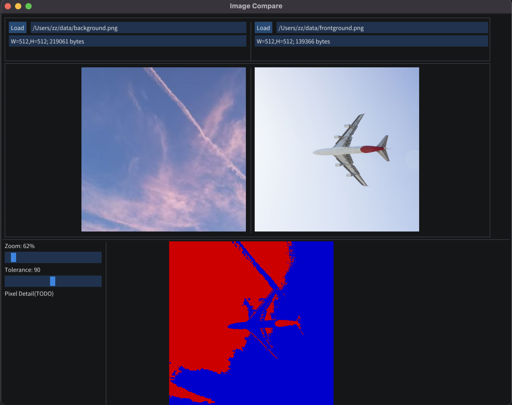

# Image Compare: Pixel Difference Visualization



## Usage
Click "Load" buttons to load images. Once both two input images loaded, the diff image is computed and displayed.

- Change `Tolerance` slider to get different compare result.
- Change `Zoom` slider or use mouse wheel to scale current image.

See [images](https://github.com/zchrissirhcz/image-compare/tree/main/images) directory for testing images.

## Build
```bash
git clone https://github.com/zchrissirhcz/image-compare
cd image-compare
cmake -S . -B output -GNinja && cmake --build output
./output/ImageCompare
```

## Remarks
The [initial trial](https://github.com/zchrissirhcz/small-compare/tree/qt) was based on Qt but no longer maintained due to law issue.

## References
- https://github.com/ocornut/imgui/wiki/Image-Loading-and-Displaying-Examples
- https://github.com/aang7/Pix
- https://github.com/shangchiwu/advanced-image-processor
- https://www.youtube.com/watch?v=OYQp0GuoByM
- https://github.com/Smorodov/imgui_image_viewer
- https://github.com/CedricGuillemet/imgInspect