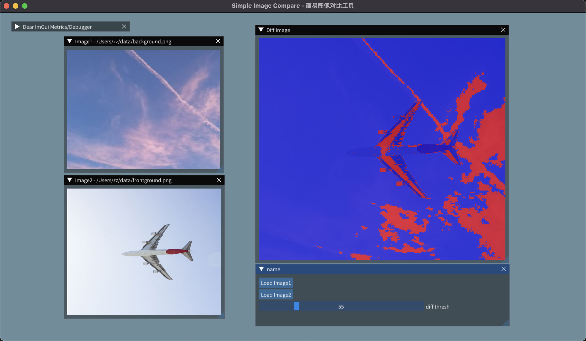

# Image Compare

Simple cross-platform (macOS, Linux, Windows) image comparison GUI tool.

## Usage
Load two images in "Image1" and "Image2" window respectively, then the diff image appeared. With new loaded image1 / image2, or adjusted threshold value, diff image updated.

## Dependencies
- [Dear ImGui](https://github.com/ocornut/imgui) with [glfw](https://github.com/glfw/glfw) and OpenGL backends
- [OpenCV](https://github.com/opencv/opencv)
- [CMake](https://cmake.org)

## Remarks
The initial implementation is based on Qt, and is not updated anymore, for the sake of license and law (for example, on the company's computer, a lawyer's letter is received when the QtCreator development environment is installed).
You can switch to the [Qt branch](https://github.com/zchrissirhcz/small-compare/tree/qt) to view the source code.

## References
- https://github.com/ocornut/imgui/wiki/Image-Loading-and-Displaying-Examples
- https://github.com/aang7/Pix
- https://github.com/shangchiwu/advanced-image-processor
- https://www.youtube.com/watch?v=OYQp0GuoByM
