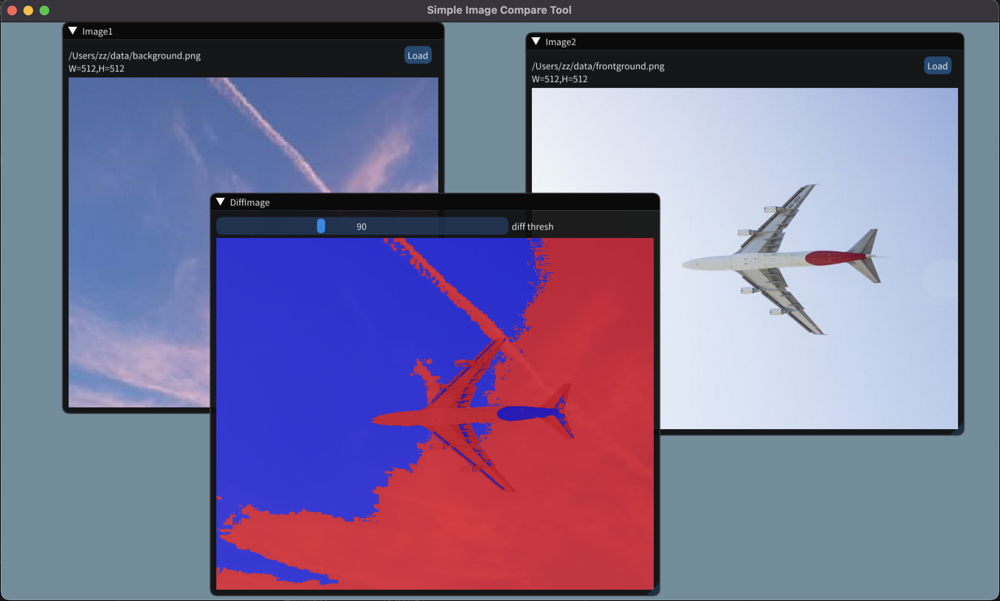

# Image Compare

Simple cross-platform (macOS, Linux, Windows) image comparison GUI tool.

## Usage
Choose two input images by click "Load Image1" and "Load Image2" buttons respectively, then the difference image appeared automatically.
When the mouse drags the threshold slider, the difference image is automatically updated.

## Dependencies
- [Dear ImGui](https://github.com/ocornut/imgui) with [glfw](https://github.com/glfw/glfw) and OpenGL backends
- [OpenCV](https://github.com/opencv/opencv)
- [CMake](https://cmake.org)

## References
- https://github.com/ocornut/imgui/wiki/Image-Loading-and-Displaying-Examples
- https://github.com/aang7/Pix
- https://github.com/shangchiwu/advanced-image-processor